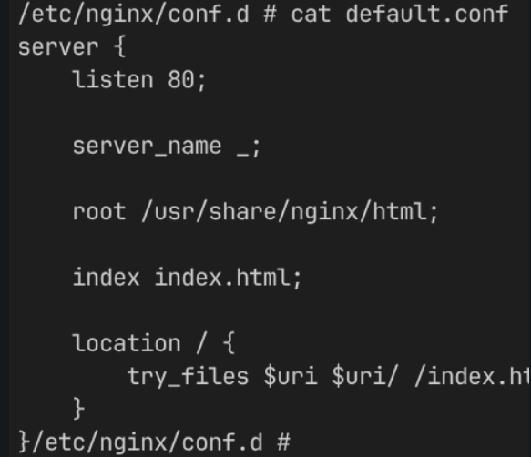

1. init setup: group: sudo groupadd user: sudo useradd -m at srv:sudo mkdir add user to group: sudo usermod -aG
2. make koda as owner and devteam the group sudo chmod :
3. restricting acc sudo chmod 750
4. cd , mkdir , touch , cd .. <back dir 1 step>
5. chmod 770 app.sh
6. chmod 700 input.txt
7. chmod -R g=rwx src
8. chmod -R koda:devteam srv/project
9. chmod -R o-rwx /src/projectX
10. add koda to sudo group: sudo usermod -aG wheel koda sudo chmod 750 README.md
11. sudo chown -R dako:devteam /srv/projectX

